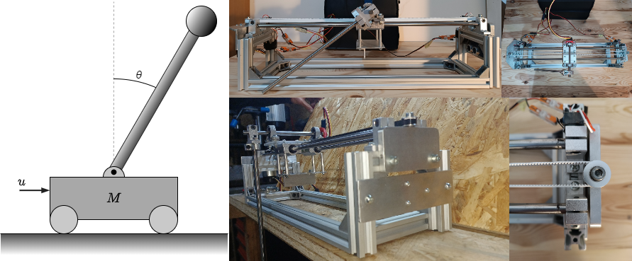
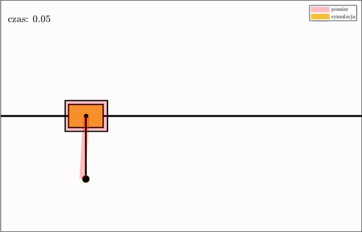
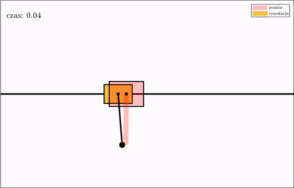
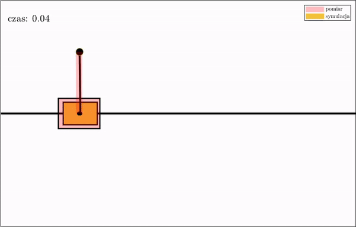
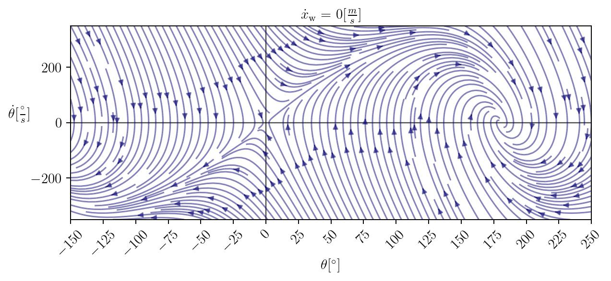
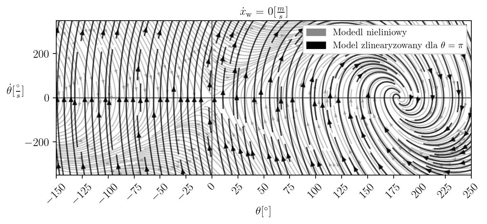

Matlab and python scripts developed for linear inverted pendulum build, control system design and implementation project.

Down and up position controller is based on LQR, swingup is done with optimal trajectory (optimTraj for Matlab): 
https://github.com/MatthewPeterKelly/OptimTraj

Python (sympy, numpy, matplotlib) is used to derive pendulum model and draw some phase portraits of nonlinear and linear models. 

Implementation of controller app on stm32 microcontroller: 
https://github.com/bubleBoble/invertedPendulumStmFreeRTOSapp/tree/master

Videos of real device:
https://drive.google.com/drive/folders/163VPpn8IbY97kRAhWoEIGUsHin9m1j5x?usp=sharing

<b> Final build: </b>

<b> Swingup: </b> (pink measurement, yellow simulation)
Pink animation is generated from measurement from real device, near up pendulum arm position it is caught by stabilizaing controler. 

<b> Down position control: </b>

<b> Up position control: </b>

<b> Phase portrait </b> from <em> imgs/phasePortraits/nonlinearModel</em> and <em>imgs/phasePortraits/LinearAndNonlinearModel</em>:

